# CreatorPulse

> **An autonomous AI content growth loop that learns from every publish.**

CreatorPulse turns a creator's content history and performance signals into an evolving next move. It identifies opportunities, catches topic collisions before they become repetitive uploads, generates a platform-ready content package, validates it, prepares an honest simulated schedule, compares prediction with actual performance, and updates Creator Memory so the next recommendation gets smarter.

## The Problem: Accidental Cannibalization & Open-Loop Amnesia

The single biggest silent killer of YouTube channel momentum is **accidental cannibalization**: a creator unknowingly remakes a topic they covered 4 months earlier, splitting their own audience and tanking their 48-hour CTR by **up to 38%**. 

Meanwhile, every existing "AI creator tool" operates as an open-loop prompt box: you generate an outline, copy-paste it to YouTube, and the model forgets everything. If the video flops or explodes, the tool is just as blind next Monday.

CreatorPulse solves this with a **closed-loop autonomous growth engine**:
1. It ingests your actual video history (via **live public YouTube URL/handle ingestion** or CSV/JSON upload, plus a 42-video reference catalog).
2. It detects topic collisions and audience fatigue using **Google Gemini dense vector embeddings** before you shoot.
3. It carries winning ideas through a **deterministic 7-rule quality gate** into production.
4. It records real-world post-publish metrics and **permanently compounds creator memory** ($v3 \to v4 \to v5$).

## The 3-Minute Golden Path

The fastest way to experience the autonomous growth loop is the built-in Golden Path (see detailed script in [`docs/demo-script.md`](docs/demo-script.md)):

1. **Pulse (`/dashboard`)**: Inspect the 3-minute evaluation stepper and the **Creator Workflow Economy Card** (**8 hours 15 minutes saved** per video / 97% time reduction based on benchmarked creator production timing: ideation & collision check 120m $\to$ 5m, research & drafting 180m $\to$ 8m, QA 45m $\to$ 30s, shorts extraction 120m $\to$ 1.5m).
2. **Channel (`/channel`)**: Ingest **any live YouTube channel** (e.g., `@fireship`, `@mkbhd`, `@veritasium`, or your own channel URL) or inspect the 42-video baseline catalog.
3. **Decide (`/opportunities`)**: Click **"Why this score? ▼"** on any card to view the exact mathematical attribution formula (`Score = 0.35×Fit + 0.30×Hist + 0.25×Nov - 0.10×Collision`).
4. **Before I Publish (`/before-publish`)**: Run real **Gemini dense vector cosine embeddings** across the catalog to detect cannibalization before shooting.
5. **Content Factory (`/opportunities/:id`)**: Pick a voice profile (*Thoughtful Technical*, *High-Velocity Builder*, *First-Principles*), generate the full package, and export as clean Markdown.
6. **QA Gate (`/qa`)**: Run the 7 deterministic validation checks (no LLM hallucinated passes).
7. **Publish (`/calendar`)**: Approve with 1-click calendar sync.
8. **Measure & Learn (`/analytics`)**: The Climax! Run **Cycle 1 (`video-42`)** or **Cycle 2 (`video-41`)** to watch Memory upgrade live ($v3 \to v4 \to v5$) and re-rank subsequent opportunities (+5 pts).
9. **Audit Trail (`/activity`)**: Inspect the full agent execution log with trace IDs.

## Core Technical Differentiators

- **Live Public YouTube & Custom History Ingestion**: Paste any channel handle or upload CSV/JSON export; the growth loop, vector embeddings, and opportunity scoring immediately calculate against real creator data.
- **True Semantic Embedding Cosine Similarity**: Google Gemini `text-embedding-004` + 128d dense subword hash fallback mathematically evaluates catalog similarity, far surpassing simple keyword matching.
- **Explainable Attribution Math**: Section 50 formula transparency gives creators traceable justifications for every recommendation.
- **Deterministic 7-Rule Quality Gate**: Code-level validation catches retention flaws and collision risks before publishing.
- **Multi-Cycle Compounding Memory**: A genuine closed feedback loop where measured performance dynamically updates creator knowledge and alters future rankings.
- **Creator Workflow Economy**: Quantified 97% time reduction (8.5 hours manual down to 15 minutes autonomous across measured pre-production, scripting, and post-distribution tasks).

### Architectural Category Comparison

| Architectural Dimension | Generic Prompt Generators | Single-Screen Checkers | Narrow Brief Checkers | **CreatorPulse Closed Growth Loop** |
| :--- | :--- | :--- | :--- | :--- |
| **Loop Architecture** | Open-loop prompt wrapper (resets to zero) | Isolated static tool (no channel history) | Narrow single brief validator | **✅ Closed feedback loop ($v3 \to v4 \to v5$)** |
| **Opportunity Sizing** | ❌ None (user guesses ideas) | ❌ None | ❌ None | **✅ Section 50 traceable attribution formula** |
| **Catalog Collision Engine** | ❌ Token overlap / un-wired | ❌ Pixel-only or none | ❌ None | **✅ Gemini embeddings + 128d dense vectors across 42 videos** |
| **Content Factory Surface** | ⚠️ Unfinished stubs / templates | ❌ Transcript only | ❌ None | **✅ 5 Surfaces: Long-form, 3 Shorts, Social, SEO, Thumbnails** |
| **Deterministic QA Gate** | ❌ LLM self-grading | ⚠️ Basic length heuristics | ⚠️ Sponsor checks only | **✅ 7-Rule deterministic gate + Sponsor compliance audit** |
| **Publishing Release Pack** | ❌ None | ⚠️ Basic transcript markdown | ❌ None | **✅ 1-Click Markdown Pack + JSON Spec with chapter timestamps** |
| **Compounding Memory** | ❌ Prompt Amnesia | ❌ No memory | ❌ No memory | **✅ Persistent PostgreSQL memory with topic confidence shift** |
| **Automated Test Suite** | ❌ Zero tests | ❌ No test runner | ❌ No tests | **✅ 14/14 automated tests passing in <1s (`pnpm test`)** |

## Architecture

```mermaid
flowchart LR
  UI[React command center] --> API[Express API]
  API --> ORCH[Growth loop orchestrator]
  ORCH --> BRAIN[Channel + audience + content intelligence]
  BRAIN --> OPPS[Explainable opportunity engine]
  OPPS --> FACTORY[Content factory]
  FACTORY --> QA[Deterministic quality gate]
  QA --> REVIEW[Creator approval]
  REVIEW --> PUBLISH[Demo scheduler / publisher adapter]
  PUBLISH --> ANALYTICS[Measurement engine]
  ANALYTICS --> LEARN[Learning engine]
  LEARN --> MEMORY[(PostgreSQL Creator Memory)]
  MEMORY --> OPPS
```



See [docs/architecture.md](docs/architecture.md) for the system diagram and data flow notes.

## Product surface

- **Pulse**: recommended next move, explainable score, loop status, and agent trace.
- **Channel intelligence**: topic performance, format fit, video history, and demo-data provenance.
- **Opportunity map**: ranked ideas with audience fit, novelty, historical fit, collision risk, effort, and confidence.
- **Before I publish**: deterministic counterfactual evaluation against the existing library.
- **Content factory**: one coherent package across long-form, Shorts, social, SEO, and thumbnail direction.
- **Quality gate**: title, description, SEO, CTA, originality, claim-risk, and audience-fit checks.
- **Calendar**: creator approval and clearly labeled demo scheduling.
- **Analytics**: prediction versus actual performance.
- **Memory**: persistent topic, format, hook, timing, and learning signals.

## Stack

- React + Vite + TypeScript
- Express 5 + typed OpenAPI contract
- PostgreSQL + Drizzle ORM
- Orval-generated React Query hooks and Zod validation
- Tailwind CSS + shadcn/ui primitives

## Run locally

```bash
pnpm install
pnpm --filter @workspace/db run push
pnpm --filter @workspace/api-spec run codegen
```

The project workflows start the API and web app:

```bash
pnpm --filter @workspace/api-server run dev
pnpm --filter @workspace/creatorpulse run dev
```

The built-in PostgreSQL database is required through `DATABASE_URL`. The demo does not require an external API key.

## API

The source of truth is `lib/api-spec/openapi.yaml`. The main routes are:

```text
GET  /api/pulse
GET  /api/channel
GET  /api/opportunities
GET  /api/opportunities/:id
POST /api/opportunities/:id/generate
GET  /api/content/:id
POST /api/content/:id/qa
POST /api/content/:id/approve
POST /api/before-publish
POST /api/measure
GET  /api/memory
GET  /api/activity
GET  /api/calendar
GET  /api/settings
POST /api/settings
```

## Demo mode and limitations

- Channel metrics are an explicit demo/public-metrics sample; private YouTube analytics are not fabricated.
- Publishing is simulated and labeled as such until a legitimate platform adapter is connected.
- When `GEMINI_API_KEY` is configured, content packages are generated through Gemini and normalized into the CreatorPulse contract. If Gemini is unavailable, the deterministic strategy engine keeps the core loop reliable and inspectable.
- A production version would add YouTube OAuth, live YouTube Analytics ingestion, background jobs, object storage for media, and a provider-backed QA reasoning layer.

## Submission positioning

**CreatorPulse — Your next video isn't a guess.**

It automates the work around creation while preserving the creator's approval gate. The strongest demo moment is not the generated script; it is the measured result feeding back into the next recommendation.