# CreatorPulse

> **An autonomous AI content growth loop that learns from every publish.**

CreatorPulse turns a creator's content history and performance signals into an evolving next move. It identifies opportunities, catches topic collisions before they become repetitive uploads, generates a platform-ready content package, validates it, prepares an honest simulated schedule, compares prediction with actual performance, and updates Creator Memory so the next recommendation gets smarter.

## The demo

The fastest way to see the product is the golden path:

1. Open the command center.
2. Review the recommended next video and its explainable score.
3. Open **Before I publish** to pressure-test a competing idea.
4. Generate the full package: long-form, Shorts, social, SEO, and thumbnail direction.
5. Run the Quality Gate.
6. Approve and schedule the package in demo mode.
7. Record the measured result.
8. Open Memory and see the recommendation change.

The app ships with a transparent demo channel so judges can reach the complete loop without external OAuth credentials.

## Why this is different

Most creator tools stop at generation. CreatorPulse connects:

```text
CONNECT → UNDERSTAND → DECIDE → CREATE → VERIFY → PUBLISH → MEASURE → LEARN
```

The scores are computed from channel history, topic fit, novelty, collision risk, production effort, and measured performance. CreatorPulse does not label an idea “viral” with certainty and does not pretend simulated publishing is a live platform API call.

## Architecture

```mermaid
flowchart LR
  UI[React command center] --> API[Express API]
  API --> ORCH[Growth loop orchestrator]
  ORCH --> BRAIN[Channel + audience + content intelligence]
  BRAIN --> OPPS[Explainable opportunity engine]
  OPPS --> FACTORY[Content factory]
  FACTORY --> QA[Deterministic quality gate]
  QA --> REVIEW[Creator approval]
  REVIEW --> PUBLISH[Demo scheduler / publisher adapter]
  PUBLISH --> ANALYTICS[Measurement engine]
  ANALYTICS --> LEARN[Learning engine]
  LEARN --> MEMORY[(PostgreSQL Creator Memory)]
  MEMORY --> OPPS
```



See [docs/architecture.md](docs/architecture.md) for the system diagram and data flow notes.

## Product surface

- **Pulse**: recommended next move, explainable score, loop status, and agent trace.
- **Channel intelligence**: topic performance, format fit, video history, and demo-data provenance.
- **Opportunity map**: ranked ideas with audience fit, novelty, historical fit, collision risk, effort, and confidence.
- **Before I publish**: deterministic counterfactual evaluation against the existing library.
- **Content factory**: one coherent package across long-form, Shorts, social, SEO, and thumbnail direction.
- **Quality gate**: title, description, SEO, CTA, originality, claim-risk, and audience-fit checks.
- **Calendar**: creator approval and clearly labeled demo scheduling.
- **Analytics**: prediction versus actual performance.
- **Memory**: persistent topic, format, hook, timing, and learning signals.

## Stack

- React + Vite + TypeScript
- Express 5 + typed OpenAPI contract
- PostgreSQL + Drizzle ORM
- Orval-generated React Query hooks and Zod validation
- Tailwind CSS + shadcn/ui primitives

## Run locally

```bash
pnpm install
pnpm --filter @workspace/db run push
pnpm --filter @workspace/api-spec run codegen
```

The project workflows start the API and web app:

```bash
pnpm --filter @workspace/api-server run dev
pnpm --filter @workspace/creatorpulse run dev
```

The built-in PostgreSQL database is required through `DATABASE_URL`. The demo does not require an external API key.

## API

The source of truth is `lib/api-spec/openapi.yaml`. The main routes are:

```text
GET  /api/pulse
GET  /api/channel
GET  /api/opportunities
GET  /api/opportunities/:id
POST /api/opportunities/:id/generate
GET  /api/content/:id
POST /api/content/:id/qa
POST /api/content/:id/approve
POST /api/before-publish
POST /api/measure
GET  /api/memory
GET  /api/activity
```

## Demo mode and limitations

- Channel metrics are an explicit demo/public-metrics sample; private YouTube analytics are not fabricated.
- Publishing is simulated and labeled as such until a legitimate platform adapter is connected.
- The content package uses the deterministic strategy engine when no external LLM provider is available. This keeps the core loop reliable and inspectable.
- A production version would add YouTube OAuth, live YouTube Analytics ingestion, background jobs, object storage for media, and a provider-backed content reasoning layer.

## Submission positioning

**CreatorPulse — Your next video isn't a guess.**

It automates the work around creation while preserving the creator's approval gate. The strongest demo moment is not the generated script; it is the measured result feeding back into the next recommendation.