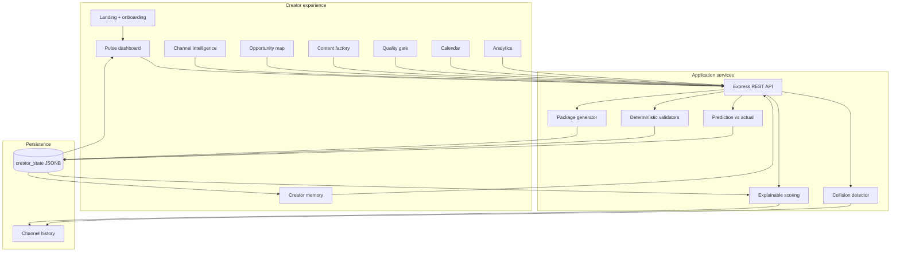

# CreatorPulse architecture

CreatorPulse is organized around one closed growth loop rather than a set of disconnected generators.

## Design rules

1. Deterministic calculations own numeric scores and baseline comparisons.
2. Reasoning outputs carry their source signals so creators can challenge them.
3. Creator approval is required before the demo scheduler marks content as scheduled.
4. Demo data is labeled at the source instead of being presented as private analytics.
5. Measured performance updates Creator Memory and changes future opportunity ranking.