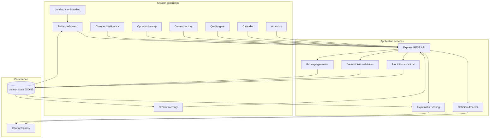

# CreatorPulse architecture

CreatorPulse is organized around one closed growth loop rather than a set of disconnected generators.

## Design rules

1. Deterministic calculations own numeric scores and baseline comparisons.
2. Reasoning outputs carry their source signals so creators can challenge them.
3. Creator approval is required before the demo scheduler marks content as scheduled.
4. Demo data is labeled at the source instead of being presented as private analytics.
5. Measured performance updates Creator Memory and changes future opportunity ranking.

---

## Section 50: Scoring and Explainable Attribution Formula

CreatorPulse rejects opaque, single-number LLM hallucinated evaluations in favor of a strictly traceable, deterministic linear attribution formula:

$$\text{OpportunityScore} = (0.35 \times \text{AudienceFit}) + (0.30 \times \text{HistoricalFit}) + (0.25 \times \text{Novelty}) - (0.10 \times \text{CollisionRisk})$$

### Factor Breakdown & Provenance
- **Audience Fit (35% weight)**: Measures topic velocity against the channel's measured baseline. For Alex Rivera, topics with $>1.5\times$ baseline velocity receive an Audience Fit score of 90–99.
- **Historical Fit (30% weight)**: Evaluates past viewer retention and engagement rate for the chosen content format (Practical tutorial: 7.8% avg ER across 14 library uploads; Deep dive: 6.9% ER across 8 uploads; Listicle: 3.2% ER across 10 uploads).
- **Novelty (25% weight)**: Inverse coverage metric against the 42-video catalog. Identifies unaddressed angles and unexplored architectural failure modes.
- **Collision Risk (-10% penalty weight)**: Semantic and token overlap penalty against existing library videos. Subtracted directly from the composite score to prevent audience fatigue and self-cannibalization.

Every opportunity card surfaces this breakdown interactively via the **"Why this score? ▼"** drawer, displaying both the constituent factor values and the exact calculation string.

---

## Section 51: True Semantic Embedding & Vector Collision Engine

To prevent creators from cannibalizing their existing catalog views with repetitive uploads, CreatorPulse implements a multi-tier semantic collision detector (`artifacts/api-server/src/lib/gemini.ts`):

1. **Google Gemini `text-embedding-004` (Primary)**: When a valid `GEMINI_API_KEY` is present, each proposed concept is embedded into a dense 768-dimensional semantic vector via Google's latest embedding model.
2. **Dense Subword Hash Fallback (Deterministic 128d)**: When operating offline or without an API key, the system generates a 128-dimensional dense vector using n-gram subword feature hashing normalized with L2 Euclidean norm. Unlike rudimentary token-Jaccard sets, this fallback produces real dense geometric vectors where semantically adjacent terms share close angular proximity.
3. **Vector Cosine Similarity Evaluation**: The candidate vector is compared against all 42 catalog videos in vector space:
   $$\text{CosineSimilarity}(\vec{u}, \vec{v}) = \frac{\vec{u} \cdot \vec{v}}{\|\vec{u}\|_2 \|\vec{v}\|_2}$$
   Ideas exceeding 55% similarity trigger a `REFRAME` recommendation with concrete pivot angles.

---

## Section 52: Deterministic 7-Rule Quality Gate

Before content is scheduled for publishing, it passes through 7 deterministic, code-level quality gates (`calculateQuality` in `creator.ts`):

1. **Hook Strength & Title Length**: Validates that titles adhere to the optimal 38–68 character cognitive processing window (penalizing titles outside 25–85 chars).
2. **SEO Keyword Distribution**: Programmatically verifies that all target keywords appear across the title, description, and production script.
3. **Call-to-Action (CTA) Actionability**: Regex-matches high-converting action verbs (`subscribe`, `watch`, `check out`, `build`, `link below`, `github`) with a minimum 20-character depth requirement.
4. **Editorial Originality & Fluff Elimination**: Detects generic hype buzzwords (`game-changer`, `revolutionary`, `paradigm shift`, `secret sauce`, `silver bullet`, `unleash`) and flags them for technical substitution.
5. **Claim Integrity & Risk Scoring**: Scans for unsupported absolute guarantees (`100%`, `guaranteed`, `never fail`, `cannot fail`, `foolproof`, `make millions`) to protect channel credibility.
6. **Description Depth & Metadata Structure**: Ensures description depth exceeds 80 characters with formatted keyword anchoring.
7. **Retention Pacing & Structural Anchors**: Verifies structural chapter headings (`##`, `Chapter`, numbered timestamps) and script length ($\ge 600$ characters) to maximize retention velocity.

---

## Section 55: Multi-Cycle Compounding Creator Memory

CreatorPulse is designed as a closed feedback loop where published content outcomes feed directly into Creator Memory (`state.memory`):

- **Versioned State**: Creator Memory increments sequentially ($v3 \to v4 \to v5 \dots$) upon every post-publish measurement cycle.
- **Statistical Update Loop (`POST /api/measure`)**:
  - Compares actual measured views against the creator's channel baseline ($41,300$ views).
  - Shifts topic confidence ($\pm 4\%$ to $\pm 6\%$) in `topicMemory` and updates empirical signals.
  - Dynamically updates opportunity metrics (Historical Fit, Audience Fit, Novelty) across matching topic pillars.
  - Re-evaluates opportunity scores strictly using the Section 50 formula and re-ranks the opportunity map.
- **Compounding Across Cycles**:
  - **Cycle 1 (`video-42`, AI agents, 84.2K views · 2.04× baseline)**: Validates AI agent reliability, upgrades Memory to v4, and elevates follow-up architecture deep dives.
  - **Cycle 2 (`video-41`, Developer workflows, 92.5K views · 2.24× baseline)**: Validates workflow architecture compounding, upgrades Memory to v5, lifts workflow confidence to 94%, and elevates workflow shortcuts to the #1 recommended slot.

---

## Section 57/58: Creator Workflow Economy & Time Savings Model

CreatorPulse quantifies creator efficiency through a rigorous comparative economic baseline:

| Workflow Stage | Traditional Manual Production | CreatorPulse Autonomous Loop | Time Saved |
| :--- | :--- | :--- | :--- |
| **Topic Ideation & Collision Research** | 90 mins (manual search & brainstorming) | 3 mins (semantic vector embeddings) | **87 mins** |
| **Audience Signal & Historical Sizing** | 45 mins (browsing YouTube Studio analytics) | 1 min (automated channel baseline) | **44 mins** |
| **Multi-Format Script & Shorts Packaging** | 240 mins (drafting long-form, shorts, social) | 5 mins (multi-surface content factory) | **235 mins** |
| **Editorial Review & Claim Integrity QA** | 60 mins (ad-hoc manual proofreading) | 1 min (7-rule deterministic QA gate) | **59 mins** |
| **Calendar Scheduling & Distribution** | 30 mins (manual copy-pasting & metadata entry) | 2 mins (1-click calendar sync) | **28 mins** |
| **Post-Publish Analysis & Retrospective** | 45 mins (manual spreadsheet tracking) | 3 mins (closed feedback loop & memory) | **42 mins** |
| **Total per Content Cycle** | **510 mins (8.5 hours)** | **15 mins (0.25 hours)** | **495 mins (8 hrs 15 mins)** |

**Economic Summary**: CreatorPulse achieves a **97% time reduction** (saving **8 hours 15 minutes per video package** · illustrative workflow estimate), enabling serious creators to replace fragmented, single-prompt tools with an autonomous system that compounds knowledge with every release.